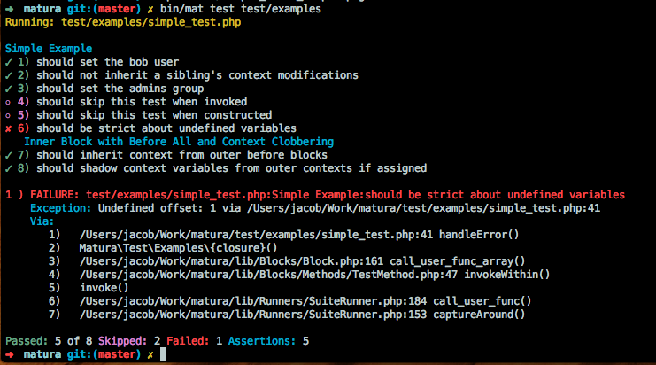

Matura
======

An RSpec / Mocha inspired testing tool for php.

[Build Status](https://travis-ci.org/jacobstr/matura.svg)

---

## Installation

1. You may need to update your composer.json file with `"minimum-stability" : "dev"`. Bare with me while I figure out how to be a better maintainer and get this stable.
2. `composer require jacobstr/matura`.

## Features

- Esperance expectation library: `expect($result)->to->have->length(2)`.	
- A succinct DSL for defining tests.
	
		describe('Matura', function ($ctx){
			it('should make writing tests fun', function ($ctx) {
				expect($are_we_having_fun_yet)->to->eql(true);
			}))
		});
	
- Heirarchical blocks to drill down from basic to complex assertions.
		  
		describe('User', function ($ctx) {
			describe('Authorization', function ($ctx){
				describe('OAuth', function ($ctx) {});
			});
		});
		
- `before`, `before_all`, `after`, `after_all`, hooks with a well-defined ordering.
 
 		describe('User Database', function ($ctx) {
 			foreach(range(1,5) as $repetition) {
	 			it('should insert a user', function ($ctx){
	 				$user = $ctx->db->findOne(array(
	 					'username' => $ctx->username;
	 				));
	 				expect($user)->to->have->length(1);
	 			});
	 			
	 			it('should not accumulate users, function ($ctx){
	 				$users = $ctx->db->find();
	 				expect($users)->to->have->length(1);
	 			});
 			}
 			
 			// Executed once for each describe block.
 			before_all(function ($ctx){
 				$ctx->test_id = uniqid();
 				$ctx->test_db = 'DB_'.$ctx->test_id;
 				$ctx->db = new Database('localhost', $ctx->test_db);
 			});
 			
 			// Executed prior to each test (including descendants).
 			before(function ($ctx){
 			 	$ctx->username = 'test_user'.$ctx->test_id.uniqid();
 				$ctx->db->insert(array('username' => $ctx->username)); 
 			});
 			
 			// Executed after each test (including descendants);
 			after(function ($ctx) {
 				$ctx->db->delete(array('username' => $ctx->username));
 			});
 			
 			// Executed once at the very end of this describe block.
 			after_all(function ($ctx) {
 				$ctx->db->drop($ctx->test_db);
 			});

## The CLI

This is how it looks if you run: `bin/mat test test/examples`.

	bin/mat test <path> [--filter=] [--grep=]

Tests can be filtered by filename using the `--filter` option. If you wish to filter specific tests within a suite/file, use `--grep`. Matura will be clever enough to run the requisite before/after hooks - hopefully. We're still fairly alpha ;)

## Further Documentation

Unfortunately, for now: the [tests](test/functional) [themselves](test/integration).

* [In what order is everything run?](test/functional/test_ordering.php)
* [What is that $ctx parameter?](test/functional/test_context.php)

## Naive Todo List

* There's currently nothing like PHPUnit's backupGlobals.
* xit / xdescribe are skipped, but this is not indicated in the ui.
* Backtraces annoyingly include calls internal to the framework.

## Thanks!

* [Ben Zittlau](https://github.com/benzittlau) - PHPUsable which brings similar syntax to PHPUnit. Helped me realize this was a worthwhile diversion.
